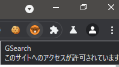

## GSearchとは
・google chrome用の拡張機能です。
　範囲選択済みの単語を、google画像検索するものです。

## 使い方
・ブラウザーで、任意のサイトを開いて、調べたい画像の単語を範囲をマウスで範囲選択します。

・単語を範囲選択したら、拡張機能ボタンの「くま」のアイコンをクリックすると、範囲選択済みの単語を、googleの画像検索で新しいタブで開きます。

### インストールにあたっての前提条件
・chromeのデベロッパーモードを有効にしておいてください。

### インストール手順
・chromeの設定メニューから拡張機能を選び、「パッケージ化されていない拡張機能を読み込む」から本フォルダーを選んでインストールします。
 
・拡張機能で「くま」のアイコン表示を固定にして下さい。

### ライセンス
MIT

### 連絡先
discordにて連絡をください。

tora#3327
